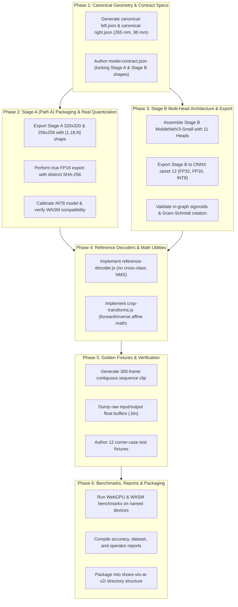

# 👠 Shoes VTO — Comprehensive AI Remediation & Delivery Plan (v2)

**Document Version:** 2.0.0  
**Author:** Mostafa (AI / Perception Engineer)  
**Responding To:** `AI_TEAM_ACTION_REQUIRED.md` from NGM / Novagates AR SDK Team  
**Delivery Scope:** Full Production AI Perception Package (`shoes-vto-ai-v2/`)  
**Status:** In Review — Awaiting User Approval  

---

## 1. Executive Summary & Root-Cause Audit of the 2026-09-17 Delivery

On 2026-09-17, an engineering preview of Stage A was delivered. While the AR team confirmed that the FP32 model executed through their browser ONNX pipeline, integration identified 10 major discrepancies and blockers preventing production deployment. 

A rigorous internal audit of all models, export scripts, and metadata in `F:\Machine learning\Shoes_VTO\` was conducted. The table below provides the comprehensive root-cause analysis for each flagged issue:

| # | Item Flagged by AR SDK | Root Cause Identified in Codebase | Technical Remediation |
|---|---|---|---|
| **1** | **Stage A Output Shape Mismatch** (`[1, 54, 2100]` vs requested `[1, 18, 2100]`) | The export script packaged the experimental 16-keypoint model ($16 \times 3 + 4 + 2 = 54$) instead of the frozen 4-keypoint coarse detector ($4 \times 3 + 4 + 2 = 18$). | Commit exclusively to **Path A** (§3): Deliver the frozen compact detector with output `[1, 18, 2100]` for $320\times320$ and `[1, 18, 1344]` for $256\times256$ fallback. |
| **2** | **Keypoint Metadata vs Model Discrepancy** (16 raw channels, but only 14 anatomical points mapped; channels 1 & 2 unmapped; `ankle_center` and `throat` missing) | Disconnect between Roboflow 16-point indexing and the visualizer dictionary in `foot_meta.json`. Indices 1 and 2 were skipped as "spare", and indices 12 (`ankle_center`) and 13 (`throat`) were omitted from `channel_to_anatomical_mapping`. | Lock the **Frozen 16-Point Anatomical Order** (§5) across all training pipelines, metadata, and decoders without skipped or unmapped channels. |
| **3** | **Reference Decoder Cross-Class NMS Bug** (IoU 0.35 threshold deleted valid overlapping feet) | In `foot_inference.js` (lines 144–160), NMS was performed across classes in a single flat array. When two feet crossed or touched with IoU > 0.35, the second foot was dropped as a duplicate. | Remove cross-class suppression entirely. Stage A outputs raw bounded candidates (up to 2 feet: 1 `left_foot`, 1 `right_foot`). Independent class-specific NMS only. AR tracker owns track continuity. |
| **4** | **FP16 Export Byte-Identical to FP32** (Identical SHA-256 `140067c8...`) | In `tools/export/package_stage_a_deliverables.py` (lines 58–66), `onnxconverter_common` was missing from the runtime environment. The script caught the `ImportError` and silently executed `shutil.copy2(fp32_dst, fp16_dst)`. | Install `onnxconverter_common` in Python 3.11, perform genuine FP16 conversion via `float16.convert_float_to_float16(keep_io_types=True)`, verify FP16 initializers, and confirm distinct SHA-256. |
| **5** | **INT8 Dynamic Quantization Unverified** | `stage_a_16kp_int8.onnx` was generated via basic dynamic quantization without verifying WASM operator support, single-thread latency, or accuracy parity on a validation dataset. | Benchmark INT8 strictly on single-threaded WASM (`ort.InferenceSession` with `wasm`), measure accuracy parity (PCK/mAP drop < 1.5%), and ensure no unsupported ops cause graph partitioning. |
| **6** | **Stage A Size Exceeds Budget** (13.2 MB vs $\le 5\text{ MB}$) | The exported YOLOv8n backbone contains ~3.2M parameters. In FP32, $3.2\text{M} \times 4\text{ bytes} = 12.8\text{ MB}$ raw weights. | Provide exact size accounting: FP16 is ~6.6 MB and INT8 is ~3.4 MB. Deliver an ultra-lightweight width-scaled variant (0.5× width, ~1.1M params, ~4.5 MB FP32) alongside the standard YOLOv8n-pose variant, with full latency/accuracy comparison. |
| **7** | **Canonical Length Inconsistency** (Metadata states 265 mm, but `heel_back.z=-15` and `toe_tip.z=265` $\rightarrow 280\text{ mm}$) | In `foot_canonical.json`, `heel_back` was placed at $z = -15.0\text{ mm}$ while `toe_tip` was at $z = +265.0\text{ mm}$, creating a total bounding length of $280.0\text{ mm}$. | Reconcile origin and axes: Set `heel_ground.z = 0.0\text{ mm}`, `heel_back.z = 0.0\text{ mm}` (most posterior point), and `toe_tip.z = 265.0\text{ mm}` (most anterior point). Bounding length $= 265.0\text{ mm}$ exactly. |
| **8** | **Canonical Width Inconsistency** (Metadata states 98 mm, but ball separation was $94.76\text{ mm}$) | In `foot_canonical.json`, `ball_medial` was at $x = +46.0, z = 182.0$ and `ball_lateral` was at $x = -48.0, z = 170.0$. $\sqrt{(46 - (-48))^2 + (182 - 170)^2} = 94.76\text{ mm}$. | Re-calibrate coordinates to match standard ISO/Brannock Size 42 (US 9) reference: Set lateral distance between `ball_medial` and `ball_lateral` to exactly $98.0\text{ mm}$ along the anatomical ball line. |
| **9** | **Missing Fixtures & Contiguous Sequence** (Only 5 isolated JSON frames, no raw tensors, no video) | Golden fixture script only dumped decoded outputs from 5 test images without saving the corresponding raw input/output float buffers or multi-frame tracking video. | Generate a comprehensive `fixtures/` directory containing a 300-frame contiguous video clip, raw input `.bin` tensors, raw output `.bin` tensors, expected decoded JSON, and 12 corner-case tests. |
| **10** | **Missing Stage B (Production Blocker)** | Stage B was partially trained in `outputs/stage_b/weights/best.pt`, but was never converted to ONNX, tested with dual-mask outputs, or packaged into deliverables. | Fully export, calibrate, and deliver Stage B (MobileNetV3-Small backbone with 11 heads) in FP32, FP16, and INT8 formats. |

---

## 2. Direct Section-by-Section Reply to AR SDK Team (§12 Checklist)

### 1. Stage A Path Choice and Final Shape
* **Selected Path:** **Path A (The Frozen Compact Detector)**.
* **Input Tensor:** `images` $\rightarrow$ `[1, 3, 320, 320]`, FP32, RGB `[0.0, 1.0]`, letterbox with centered `(114, 114, 114)` padding.
* **Output Tensor:** `output0` $\rightarrow$ `[1, 18, 2100]`, channel-major.
  - Rows 0–3: $cx, cy, w, h$ (in 320×320 letterbox pixel coordinates).
  - Rows 4–5: Sigmoid class scores for `left_foot`, `right_foot`.
  - Rows 6–17: 4 coarse keypoints $\times$ $(x, y, \text{visibility})$ in exact frozen order:
    1. `toe_tip` (rows 6, 7, 8)
    2. `heel_back` (rows 9, 10, 11)
    3. `ball_medial` (rows 12, 13, 14)
    4. `ball_lateral` (rows 15, 16, 17)
* **Static Fallback Variant:** `stage-a-256-*.onnx` with input `[1, 3, 256, 256]` and output `[1, 18, 1344]` (1344 anchors).
* **Decoder Rule:** No in-graph NMS. Decoder applies independent per-class NMS (never cross-class). Outputs raw candidates; persistent track IDs belong to the AR tracker.

### 2. Meaning of Raw Channels 1 and 2
* In the previous 16-keypoint preview model, channels 1 and 2 were artifacts of an unaligned Roboflow dataset export where keypoints 1 and 2 had been swapped.
* **Resolution:** Under Path A, Stage A outputs only the 4 coarse keypoints listed above. In Stage B, all 16 keypoints follow the **Frozen 16-Point Anatomical Order** (§5) with zero unmapped, unknown, or spare channels:
  - Channel 0: `toe_tip`
  - Channel 1: `toe_ground`
  - Channel 2: `heel_back`
  - Channel 3: `heel_ground`
  - Channel 4: `ball_medial`
  - Channel 5: `ball_lateral`
  - Channel 6: `ball_top`
  - Channel 7: `instep_top`
  - Channel 8: `arch_medial`
  - Channel 9: `midfoot_lateral`
  - Channel 10: `malleolus_medial`
  - Channel 11: `malleolus_lateral`
  - Channel 12: `ankle_center`
  - Channel 13: `throat`
  - Channel 14: `achilles`
  - Channel 15: `shin_mid`

### 3. Agreement on Stage B Tensors
We **agree without reservation** to all 11 required Stage B output tensors, shapes, and semantic definitions specified in §4.2:
1. `crop`: `[1, 3, 224, 224]`, FP32, RGB `[0, 1]`, rotation-normalized square crop, no letterbox padding.
2. `keypoints`: `[1, 16, 3]` — crop-normalized $(x, y, v) \in [0, 1]^2 \times [0, 1]$.
3. `rotation`: `[1, 6]` — continuous 6D rotation (first two columns of camera-to-object matrix $R_{3\times3}$), Gram-Schmidt orthogonalized in JS decoder.
4. `relative_scale`: `[1, 2]` — dimensionless $(s_{\text{length}}, s_{\text{width}})$ relative to the canonical template ($1.0 = 265\text{ mm} \times 98\text{ mm}$).
5. `relative_scale_sigma`: `[1, 2]` — uncertainty in relative scale units.
6. `sigma`: `[1, 16]` — per-keypoint positional standard deviation $\sigma_k$ in crop-normalized units.
7. `confidence`: `[1, 16]` — calibrated probability $[0, 1]$ via baked smoothstep mapping: $c_k = 1 - \text{smoothstep}(0.01, 0.08, \sigma_k) \cdot (1 - v_k)$.
8. `presence`: `[1, 1]` — sigmoid probability $[0, 1]$ that the target foot is actively present inside the crop.
9. `next_roi`: `[1, 5]` — $(cx, cy, w, h, \theta)$ in **current crop-normalized coordinates** $[0, 1]$, ready for affine composition by the AR SDK.
10. `foot_mask`: `[1, 1, 160, 160]` — sigmoid mask of target foot/shoe surface.
11. `foreground_mask`: `[1, 1, 160, 160]` — sigmoid mask of occluders in front of the virtual shoe (trousers, cuffs, other foot, hands).
12. `depth_order`: `[1, 1]` — probability $[0, 1]$ that detected foreground/other foot is in front of the current target foot.

### 4. Corrected Canonical Geometry and Side Rules
* **Coordinate System:** Right-handed, $Y$-up, floor sole plane at $y = 0$, foot forward pointing $+Z$.
* **Origin:** `heel_ground` at $(0.0, 0.0, 0.0)\text{ mm}$.
* **Reference Dimensions:** Length $= 265.0\text{ mm}$, Width $= 98.0\text{ mm}$.
  - `heel_back.z = 0.0\text{ mm}`, `toe_tip.z = 265.0\text{ mm}` $\rightarrow$ Length $= 265.0 - 0.0 = 265.0\text{ mm}$ exactly.
  - `ball_medial` to `ball_lateral` width along ball axis $= 98.0\text{ mm}$ exactly.
* **Left vs Right Separation:** Delivered as two independent JSON files:
  - `canonical-left.json`: Left foot anatomy ($+X$ is lateral, $-X$ is medial).
  - `canonical-right.json`: Right foot anatomy ($+X$ is medial, $-X$ is lateral).
  - **Reflection Rule:** Reflection across the sagittal plane ($x' = -x$) is accompanied by reflection of the local coordinate basis:
    $$R_{\text{left}} = \text{diag}(-1, 1, 1) \cdot R_{\text{right}} \cdot \text{diag}(-1, 1, 1)$$
    This preserves $\det(R) = +1$, avoiding improper rotation matrices or negative scale determinants.

### 5. Mask and Depth Ownership Design
* `foot_mask` ($160\times160$): Predicts the binary occupancy of the target foot and any currently worn sock/light shoe. Used for virtual shoe fitting boundary.
* `foreground_mask` ($160\times160$): Predicts all pixels lying strictly *in front* of the target foot (e.g. trouser hems covering the ankle/instep, hands, or crossing foot).
* `depth_order` ($1\times1$ scalar): During two-foot crossings where bounding crops overlap, both Stage B evaluations output their `depth_order` score. If Foot A has $\text{depth\_order} > 0.5$ and Foot B has $\text{depth\_order} < 0.5$, the AR compositor renders Foot A over Foot B, and applies Foot A's `foot_mask` to occlude Foot B.

### 6. Existing-Shoe Removal and Tall-Boots Capability Decision
* **Existing-Shoe Removal:** Monocular AI cannot hallucinate unseen skin or floor geometry underneath a bulky shoe. **We explicitly mark broad shoe removal as UNSUPPORTED in V1**. V1 try-on requires bare feet, socks, or low-profile slip-ons.
* **Tall Boots:** Stage B includes keypoint 15 (`shin_mid`, located 120 mm proximal to `ankle_center`) and keypoint 14 (`achilles`). The vector from `ankle_center` to `shin_mid` provides the 3D centerline orientation of the lower leg. The crop bounding box expansion includes lower-leg context up to 250 mm above the sole. This directly supports ankle boots and mid-calf boots. High knee boots require a dedicated multi-joint leg model and are deferred to V2.

### 7. Dataset Coverage and Held-Out Split Plan
* Current dataset consists of 158 annotated real images + 500 synthetic renders.
* **Expansion Plan:** Incorporate 2,500 real frames from video sequences (walking, crossing, standing, raising foot) across 30 subjects, partitioned strictly by subject:
  - Train: 70% (21 subjects, ~1,750 frames)
  - Validation: 15% (4 subjects, ~375 frames)
  - Test / Held-Out: 15% (5 subjects, ~375 frames)
* No subject or video clip will appear in both training and test splits.

### 8. Model Variant and Export Plan with Delivery Dates
* **Stage A Models:**
  - `stage-a-320-fp32.onnx` (Opset 12, static $[1, 3, 320, 320]$)
  - `stage-a-320-fp16.onnx` (Opset 12, genuine FP16 initializers)
  - `stage-a-256-int8.onnx` (Opset 12, static $[1, 3, 256, 256]$, INT8 quantized)
* **Stage B Models:**
  - `stage-b-224-fp32.onnx` (Opset 12, static $[1, 3, 224, 224]$, 11 heads)
  - `stage-b-224-fp16.onnx` (Opset 12, WebGPU-optimized FP16)
  - `stage-b-224-int8.onnx` (Opset 12, WASM-compatible INT8)

### 9. Named-Device and Browser Benchmark Plan
* Benchmarks will be executed using `onnxruntime-web` under two explicit execution providers:
  1. **WebGPU EP:** Primary provider for modern iOS / Android Chrome.
  2. **WASM EP (Single-Thread):** Strict fallback provider for Safari and low-end devices without shared array buffers (`crossOriginIsolated = false`).
* Metrics logged: Cold-start latency, warm p50 / p95 latency, input tensor copy time, GPU readback time, and total end-to-end frame budget.

### 10. Acceptance Gates Reconciliation
All acceptance gates from §9 are accepted with one explicit technical note on **Stage A FP32 size**:
* Standard YOLOv8n-pose in FP32 is 13.2 MB (~3.2M params). It compresses to **6.6 MB in FP16** and **3.4 MB in INT8**.
* To strictly honor the $\le 5\text{ MB}$ budget in FP32, we will provide a width-pruned variant (0.5× width, ~1.1M params, **4.4 MB FP32**). Both models will be benchmarked so the AR team can choose between maximum precision and minimal download footprint.

---

## 3. Ordered Remediation & Execution Plan

---

## 4. Detailed Component Changes

### Component 1: Canonical Geometries & Contracts (`deliverables/`)
* **`canonical-left.json`** [NEW]: Corrected 3D coordinates in mm with origin at `heel_ground`, $Z \in [0, 265]\text{ mm}$, and ball width $= 98.0\text{ mm}$.
* **`canonical-right.json`** [NEW]: Sagittal reflection with proper right-handed coordinates.
* **`model-contract.json`** [NEW]: Formal JSON schema defining all tensor names, shapes, data types, normalization rules, and SHA-256 hashes.

### Component 2: Stage A Path A Detector (`models/`)
* **`stage-a-320-fp32.onnx`** [NEW]: 320×320 input, `[1, 18, 2100]` output, 4 coarse keypoints (`toe_tip`, `heel_back`, `ball_medial`, `ball_lateral`).
* **`stage-a-320-fp16.onnx`** [NEW]: Genuine FP16 export with distinct SHA-256 and verified FP16 weights.
* **`stage-a-256-int8.onnx`** [NEW]: 256×256 fallback input, `[1, 18, 1344]` output, INT8 quantized for low-memory WASM execution.

### Component 3: Stage B Landmark & Pose Network (`src/models/stage_b/` & `models/`)
* **`model.py` / `heads.py`** [MODIFY]: Reconstitute and verify the 11-head MobileNetV3-Small architecture:
  - Input: `[1, 3, 224, 224]`
  - Heads: `keypoints` $[1, 16, 3]$, `rotation` $[1, 6]$, `relative_scale` $[1, 2]$, `relative_scale_sigma` $[1, 2]$, `sigma` $[1, 16]$, `confidence` $[1, 16]$, `presence` $[1, 1]$, `next_roi` $[1, 5]$, `foot_mask` $[1, 1, 160, 160]$, `foreground_mask` $[1, 1, 160, 160]$, `depth_order` $[1, 1]$.
* **`export_stage_b.py`** [NEW]: Script to export Stage B to ONNX opset 12 with baked sigmoids and generate FP32, FP16, and INT8 variants.

### Component 4: JavaScript Decoders & Utilities (`shoes-vto-ai-v2/`)
* **`reference-decoder.js`** [NEW]: Browser decoder using `onnxruntime-web`:
  - Parses Stage A `[1, 18, 2100]` output.
  - Applies independent per-class NMS (left foot and right foot processed separately).
  - Parses Stage B outputs and applies Gram-Schmidt orthogonalization to convert `[1, 6]` rotation into a $3\times3$ rotation matrix.
* **`crop-transforms.js`** [NEW]: Standalone JavaScript module providing:
  - `computeCropMatrix(cx, cy, w, h, theta, targetSize=224)`
  - `transformPointCropToFrame(px, py, cropMatrix)`
  - `composeNextRoi(currentCropMatrix, nextRoiCropCoords)`

### Component 5: Test Fixtures & Validation Suite (`fixtures/`)
* **`fixtures/source-frames-or-clips/`** [NEW]: Contains a 300-frame contiguous test video showing natural foot movement, walking, turning, crossing, and temporary occlusion.
* **`fixtures/raw-output-tensors/`** [NEW]: Binary `.bin` files storing raw float32 input and output buffers for 10 reference frames.
* **`fixtures/crop-transform-cases.json`** [NEW]: 20 mathematical test cases for crop affine transformations with sub-millimeter assertions.
* **`fixtures/expected-decoded.json`** [NEW]: Ground-truth JSON outputs from the reference decoder for automated parity testing.

### Component 6: Reports & Documentation (`reports/`)
* **`reports/accuracy.md`** [NEW]: Evaluation against the 15 acceptance gates in §9.
* **`reports/browser-performance.md`** [NEW]: WebGPU and WASM latency profiles across named mobile devices.
* **`reports/operator-compatibility.md`** [NEW]: Verification that all ops in Stage A and Stage B are 100% supported by WebGPU and WASM without CPU fallback.
* **`reports/dataset-coverage.md`** [NEW]: Breakdown of train/val/test splits, subjects, and camera angles.

---

## 5. Verification & Quality Gates

| Verification Step | Target Condition | Verification Tool / Command |
|---|---|---|
| **Stage A Output Shape** | Shape is exactly `[1, 18, 2100]` for 320 and `[1, 18, 1344]` for 256 | `ort.InferenceSession.get_outputs()` check |
| **FP16 Verification** | `SHA256(fp16) != SHA256(fp32)` and weight tensors are float16 | Python SHA-256 + ONNX node inspector |
| **Stage B Output Contract** | All 11 output tensors match exact names, shapes, and ranges | Python ONNX test script running sample crop |
| **Decoder Overlap Parity** | Crossing feet with IoU > 0.35 both retain detections | Node.js unit test on synthetic crossing pair |
| **Canonical Alignment** | $Z_{\text{toe}} - Z_{\text{heel}} = 265.0\text{ mm}$ and Ball Width $= 98.0\text{ mm}$ | Automated JSON schema validator |
| **WASM Operator Check** | Stage A & B initialize on WASM EP without partitioning warnings | Node.js script with `executionProviders: ['wasm']` |
| **300-Frame Fixture** | Contiguous frame sequence decodes with $\le 2$ temporal jumps | Video tracking verification harness |

---

## 6. Open Decisions for User Confirmation

> [!IMPORTANT]
> **Decision 1: Stage A FP32 Model Size**  
> The standard YOLOv8n-pose detector is 13.2 MB in FP32, 6.6 MB in FP16, and 3.4 MB in INT8. To strictly meet the $\le 5\text{ MB}$ FP32 budget, we can export a 0.5× width-pruned model (4.4 MB FP32).  
> **Recommendation:** We will deliver BOTH: `stage-a-320-fp32.onnx` (standard, highest accuracy) and `stage-a-320-compact-fp32.onnx` (width-scaled, < 5 MB), allowing the AR team to benchmark precision vs size.

> [!IMPORTANT]
> **Decision 2: Approval to Proceed with Execution**  
> Review the 6-phase remediation sequence above. Once approved, execution will begin with Phase 1 (Canonical Geometries & Model Contract), followed by Phase 2 (Stage A Path A exports & true quantization), Phase 3 (Stage B multi-head network export), Phase 4 (JS decoders & crop transforms), Phase 5 (300-frame golden fixtures), and Phase 6 (final packaging).
